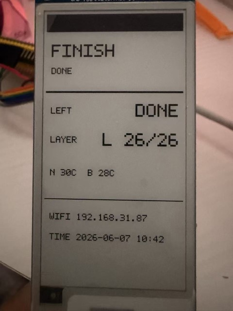

# BambuOnPaper

Arduino/PlatformIO firmware for an ESP32-S3 Bambu Lab status display on a
Zhongjingyuan 2.66 inch SSD1680 e-paper panel.



This is a lightweight Arduino rewrite of the e-paper path we built in
PrintSphere. The first version is intentionally Cloud-first: Wi-Fi setup,
Bambu Cloud CN login, Cloud MQTT live status, and monochrome e-paper rendering.

BambuOnPaper is meant to be a quiet, always-on printer companion: it shows the
current Bambu Lab print state without keeping a bright TFT backlight running all
day. The e-paper panel keeps the last status visible with very little power, so
it fits the slow-changing nature of printer progress better than a conventional
LCD/TFT screen.

## Hardware

- ESP32-S3 board
- Zhongjingyuan 2.66 inch SSD1680 SPI e-paper
- Resolution: `152x296`

## Wiring

| E-paper pin | ESP32-S3 GPIO |
| --- | --- |
| SDA / DIN / MOSI | GPIO4 |
| SCL / CLK / SCK | GPIO5 |
| CS | GPIO6 |
| DC | GPIO7 |
| RES / RST | GPIO15 |
| BUSY | GPIO16 |
| VCC | 3V3 |
| GND | GND |

`DC=0` selects commands and `DC=1` selects display data or parameters. This
build expects the SSD1680 `BUSY` pin to be idle low.

## Current Features

- Arduino framework with PlatformIO
- Wi-Fi setup AP: `PrintSphere-Setup` / `printsphere`
- Web config portal on `http://192.168.4.1` during setup
- Bambu Cloud password login
- Bambu Cloud email/SMS verification-code request and code-login submit
- CN HTTPS certificate fix using embedded GlobalSign Root CA - R3
- Cloud MQTT connection to `cn.mqtt.bambulab.com:8883`
- MQTT TLS CA pin for the current CN MQTT chain
- Live status parsing for common print fields
- SSD1680 e-paper status screen
- Differential e-paper refresh between periodic full refreshes

## First Version Limits

- Bambu Cloud 2FA is detected but not completed yet.
- Local printer MQTT is not implemented yet.
- Camera snapshots, cover preview, AMOLED/LVGL UI, PMU support, and OTA release
  packaging are intentionally left out of this Arduino rewrite.
- The Global/US cloud path is scaffolded, but the first hands-on target is CN.

## Build And Flash

Install PlatformIO, then run:

```bash
pio run
pio run -t upload
pio device monitor
```

If `pio` is not in your shell `PATH`, the PlatformIO extension install usually
also works through:

```bash
~/.platformio/penv/bin/pio run
~/.platformio/penv/bin/pio run -t upload
~/.platformio/penv/bin/pio device monitor
```

If the port is not detected automatically:

```bash
pio run -t upload --upload-port /dev/cu.usbmodem1401
pio device monitor --port /dev/cu.usbmodem1401
```

## Setup

1. Flash the firmware.
2. Join Wi-Fi AP `PrintSphere-Setup` with password `printsphere`.
3. Open `http://192.168.4.1`.
4. Fill Wi-Fi, region, Bambu account, Bambu password, and printer serial number.
5. Save. The device reboots, connects to Wi-Fi, logs in to Bambu Cloud, and
   subscribes to Cloud MQTT.

If Bambu Cloud asks for a phone or email verification code, keep the portal
open, enter the received code, then press `Submit code`.

The Bambu password is only kept until a Cloud token is obtained. After a
successful login, the firmware saves the token and clears the stored password.

## Notes

The embedded certificates are public CA roots, not secrets. Do not commit local
photos, serial numbers, Wi-Fi credentials, or exported NVS data.
